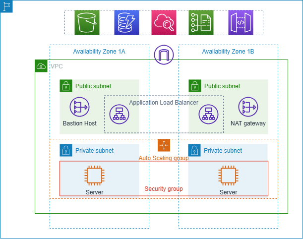
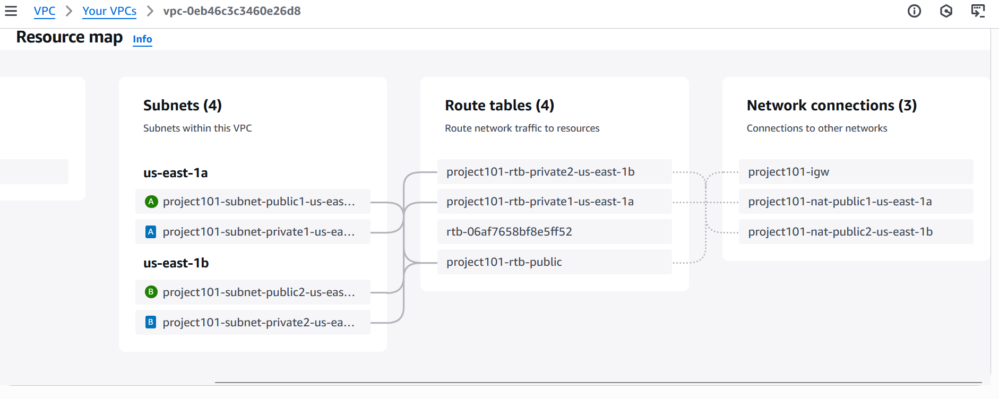
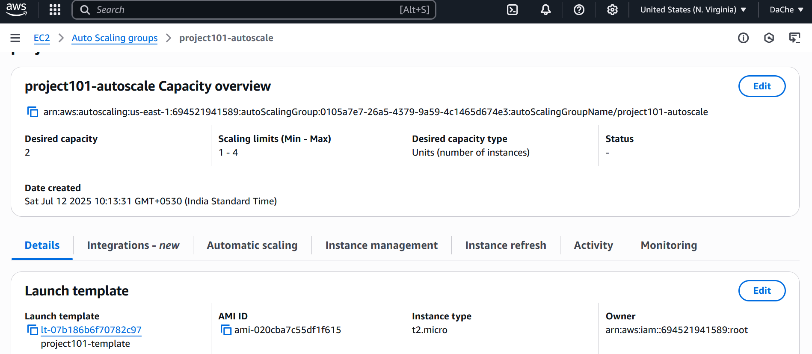
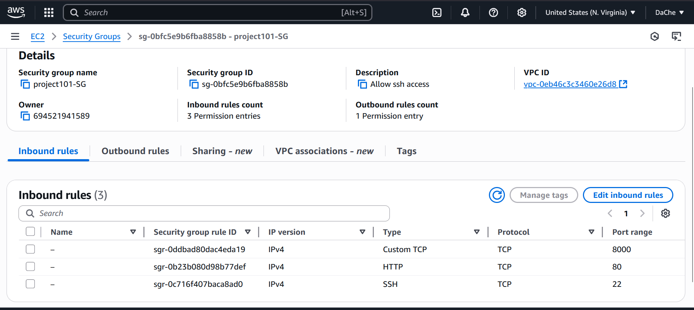
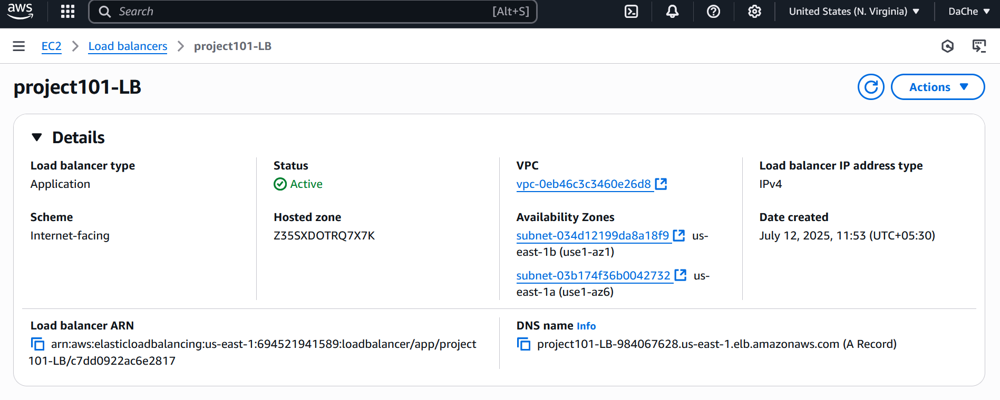
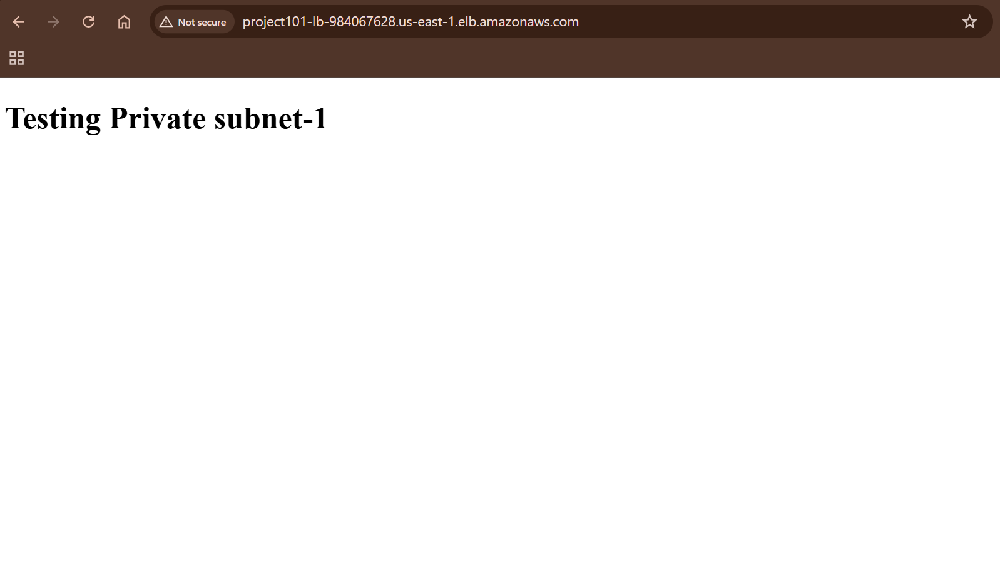

# 🛠️ Secure & Scalable AWS Architecture with VPC, Auto Scaling, Load Balancer, and Bastion Host

## 📌 Overview

This project demonstrates how to build a **secure, high-availability AWS infrastructure** using:

* Custom VPC with **public and private subnets** across **two Availability Zones**
* A **Bastion Host** for SSH access to private instances
* **Auto Scaling Group (ASG)** with launch templates
* **Application Load Balancer (ALB)** for public access
* A simple static site served using Python's HTTP server on port 8000

---

## 🧱 Architecture



*Based on architecture from [AWS Docs](https://docs.aws.amazon.com/vpc/latest/userguide/vpc-example-private-subnets-nat.html)*

---

## 🩰 AWS Services Used

* **VPC** – Custom network with private and public subnets
* **Subnets** – 2 Public & 2 Private (across 2 AZs)
* **NAT Gateway** – For internet access from private subnets
* **EC2** – Bastion Host + App Instances
* **Launch Template & ASG** – For scalable app deployment
* **Application Load Balancer (ALB)** – Public entry point
* **Security Groups (SG)** – Strict control of inbound/outbound traffic

---

## ⚙️ Step-by-Step Setup

### ✅ Step 1: Create VPC

* Go to **VPC → VPC and more**
* Disable IPv6 CIDR block
* Create:

  * 2 **public subnets**
  * 2 **private subnets**
* One **NAT Gateway per AZ** (to allow private subnet outbound traffic)
* Optionally add **VPC endpoint nodes**

### ✅ Step 2: Launch Template

* Go to **EC2 → Launch Templates**
* Select:

  * **AMI**: Ubuntu
  * **Instance Type**: `t2.micro`
  * **Key Pair**: Choose an existing key
* Create **Security Group**:

  * VPC: Select the VPC created above
  * Inbound Rules:

    * Allow SSH (port 22)
    * Custom TCP (port 8000)

### ✅ Step 3: Create Auto Scaling Group

* Select the launch template created above
* VPC: Select the same VPC
* Skip load balancer (to be added later)
* Configure size:

  * **Desired Capacity**: 2
  * **Min**: 1
  * **Max**: 4

### ✅ Step 4: Bastion Host Setup

* Launch EC2 in **public subnet**
* AMI: Ubuntu
* Assign a **public IP**
* Attach security group allowing **SSH (port 22)** from your IP

### ✅ Step 5: SSH Key Setup

* Prepare and transfer SSH key to the bastion host
* Connect to bastion and use it to SSH into private EC2 instances
* See `commands.md` for detailed commands

### ✅ Step 6: Run App in Private Instance

* Create a simple HTML file and run Python HTTP server on port 8000
* Refer to `commands.md` for setup steps

### ✅ Step 7: Configure Application Load Balancer

* Go to **EC2 → Load Balancer → Create ALB**
* Select VPC + **public subnets**
* Choose previously created **SG** (allow HTTP)
* Listener: Port 80
* Routing:

  * Create **Target Group**
  * Register **private EC2 instances** (from ASG)
  * Health check: Port 8000

### ✅ Step 8: Fix Security Group for Load Balancer

* If DNS from ALB fails to load page:

  * Go to **Security Groups → Edit Inbound Rules**
  * Add:

    * **Custom TCP** on **port 80** from `0.0.0.0/0`

### ✅ Step 9: Test Setup

* Copy DNS from **ALB**
* Open in browser:

  ``` bash
  http://<alb-dns-name>
  ```
* You should see your HTML page (served via Python from private EC2)

---

## 🔪 Learnings & Insights

* How to isolate and securely manage app servers using private subnets
* NAT Gateway enables outbound internet from private subnets
* Bastion Host allows secure, auditable access without exposing instances
* Load Balancer + Health Check enables zero-downtime access
* Security Groups misconfiguration can block HTTP even if EC2 is healthy

---

## 🚀 Future Enhancements

* Automate entire setup using **Terraform**
* Enable HTTPS with **ACM + ALB**
* Add **CloudWatch alarms** to scale on CPU usage
* Integrate CI/CD for app deployment

---

## 📸 Screenshots

Here are some key screenshots from the setup and testing process:

### VPC Configuration


### 🚀 Auto Scaling Group


### 🔐 Security Group Rules


### 🌐 Load Balancer DNS Test


### ✅ App Running in Browser


---

## 📎 Credits

* Base architecture inspired by [AWS VPC documentation](https://docs.aws.amazon.com/vpc/latest/userguide/vpc-example-private-subnets-nat.html)
* Modified to reflect my custom setup (removed S3 gateway, added Bastion Host, etc.)
---

## 📃 Additional Reference

See `commands.md` for SSH, file copy, and Python server setup commands.
